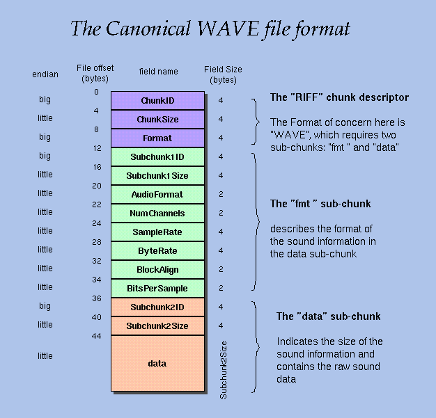

# wav-util
Simple command line utility program to view and edit wav file header data

## Background
This program was originally a school assignment. I haven't found a simple wav header editor so I decided to upload this
in case it's useful to anyone else.

## .wav file structure

* reference: http://soundfile.sapp.org/doc/WaveFormat/